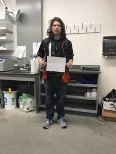
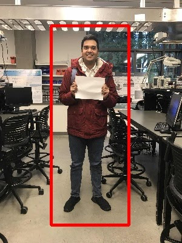

# Height Estimator 
> Program for Estimating a Person's Height using a Reference Object (Sheet of Paper) for Scale
> 
> Developed using C++ and the OpenCV Library

## Example Input
Run from IDE:

`Please input filename you would like to test.` 
`Jamie.jpg`

`Would you like height displayed in meters or feet? (F or M)` 
`F`

`Would you like an image ('overlay.jpg') overlayed onto the paper? (Y or N)` 
`N`

## Example Results
| Input  | Output |
| ------------- | ------------- |
|   **Actual: 5' 4"**  |   **Estimated: 5' 4"**  |
|   **Actual: 5' 11"**  |   **Estimated: 5' 11"**  |
|   **Actual: 5' 4"**  |   **Estimated: 4' 9"**  |
|   **Actual: 5' 9"**  |   **Estimated: 6' 2"**  |
|   **Actual: 6' 0"**  |   **Estimated: 6' 1"**  |
|   **Actual: 6' 2"**  |   **[Paper Not Found]**  |
|   **Image Overlay**  |   **Image Overlay** |

## Developers

> 🖥️ Developed by University of Washington Bothell Students

- Sean Miles
- Tung Dinh
- Bradley Pratt
